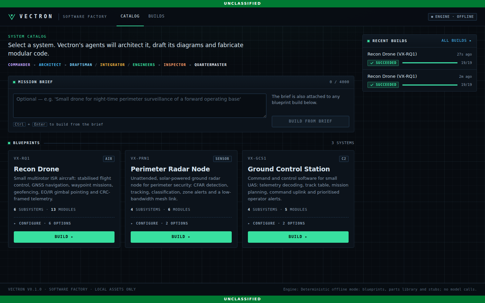
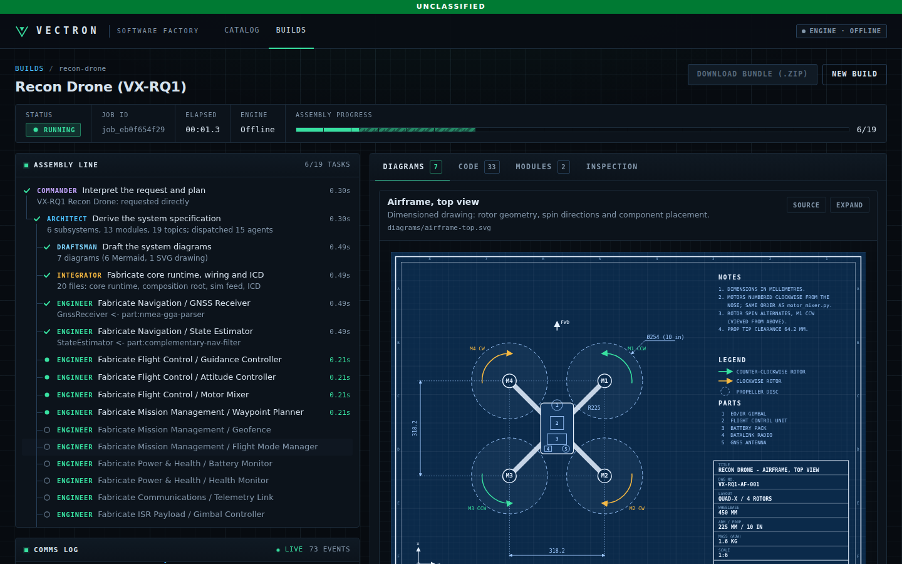
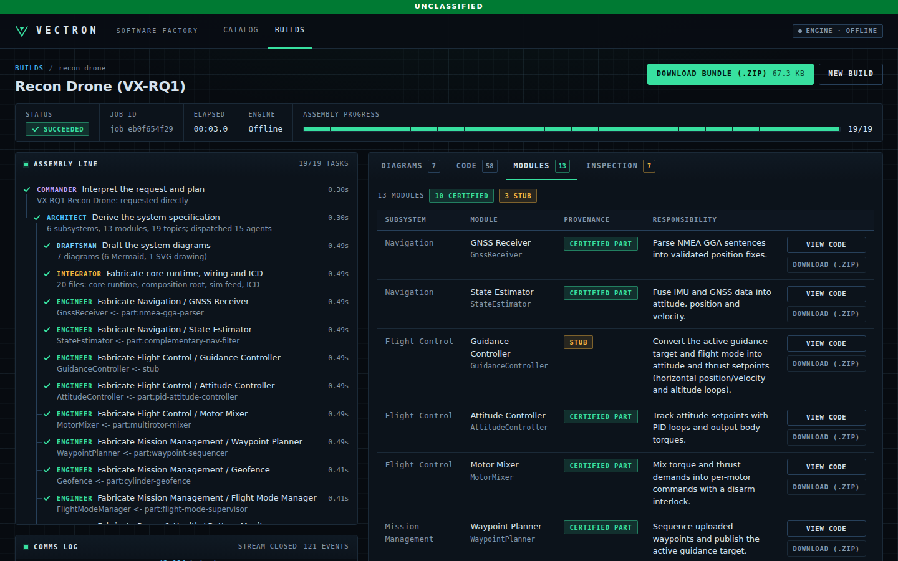

# Vectron

**Software factory for defense systems.** Pick a system, press **Build**, and a crew
of agents architects it, draws it and fabricates clean, modular, tested code that you
can download as a whole project or one module at a time.

```
Commander ─▶ Architect ─┬─▶ Draftsman ───────────┐
                        ├─▶ Integrator ──────────┤
                        ├─▶ Engineer × N modules ┼─▶ Inspector ─▶ Quartermaster ─▶ bundle.zip
                        └─▶ ...                  ┘   (quality gate)  (docs + manifest)
```





A single build of the **Recon Drone** blueprint produces:

- **Diagrams:** a dimensioned, blueprint-style airframe drawing (SVG, parametric in
  frame layout, arm length and prop size), system architecture, interface data
  flow, flight-mode state machine, mission sequence diagrams and a product
  breakdown (Mermaid).
- **Code:** a Python package with 13 independent modules (GNSS parsing, state
  estimation, PID attitude control, motor mixing, waypoints, geofence, flight-mode
  supervisor, battery monitor, CRC telemetry, gimbal pointing and more). Modules
  talk only through typed messages on a bus, so each one is testable and
  replaceable on its own. There are 52 generated tests and they pass out of the box.
- **Documents:** README, Interface Control Document, inspection report and a build
  manifest with provenance and a SHA-256 hash for every file.



## Quick start

Prerequisites: Python 3.11+, [uv](https://docs.astral.sh/uv/) and Node.js 20+.

**Easiest:** double-click `start.command` (macOS) or `start.bat` (Windows), or run
`./start.sh` / `make start`. It builds the UI the first time, starts everything on
one port and opens http://localhost:8000.

For development with live reload of both halves:

```bash
make install        # backend (uv) + frontend (npm) dependencies
make dev            # API on :8000 and UI on http://localhost:5173
```

Open http://localhost:5173 (landing page) and press **Launch Vectron**, or go straight to http://localhost:5173/app/, then press **Build** on a blueprint. `make dev` adds a
small per-task delay (`PACING=0.4`) so you can watch the agents work. Use
`make dev PACING=0` for full speed. The REST API is documented at
http://localhost:8000/docs. `make serve` builds the UI and serves everything
from port 8000.

Without the UI:

```bash
cd backend
uv run vectron blueprints                                   # the catalog
uv run vectron build recon-drone -o layout=hex-x --out ../out
uv run vectron build --brief "radar to protect a base perimeter" --out ../out
cd ../out/recon-drone && python -m pytest && python -m recon_drone
```

### Turning on Claude

**With your Claude subscription (no API key):** install Claude Code
(`npm install -g @anthropic-ai/claude-code`) and run `claude` once to log in. After
that, `start.command` / `start.bat` / `make start` automatically use it: the agents
call `claude -p` on your machine and the header shows **Engine · Claude
(subscription)**. This is for personal use on your own computer; usage counts
against your subscription limits. Force an engine with
`uv run vectron start --engine offline|claude-code|anthropic`.

**With an API key** (needed for a hosted, multi-user setup):

Vectron runs fully offline by default. Agents use the blueprint catalog, the parts
library and stubs, and make no network calls. To let the agents use Claude:

```bash
export ANTHROPIC_API_KEY=sk-ant-...
VECTRON_LLM_PROVIDER=anthropic make dev
```

With a model enabled:
- the Commander interprets free-text mission briefs and picks a blueprint only
  when it is genuinely the same kind of system;
- when nothing in the catalog fits (say, an air traffic control tower), the
  Architect designs a brand-new system from the brief: subsystems, modules,
  messages, a state machine and sequences, all validated before rendering;
- the Architect adapts the spec to the brief (new modules, config changes);
- Engineers implement stub modules.

LLM-written code must pass static vetting (import allowlist, no dangerous
builtins, unchanged interfaces) and is labelled `llm:<model>`. Any model failure
falls back to deterministic output.

## How it works

The core design decision: **every artifact is rendered from one validated system
spec.** Agents (and LLMs) edit the spec; deterministic renderers turn it into
diagrams, code and documents, so they can never drift apart. See
[docs/ARCHITECTURE.md](docs/ARCHITECTURE.md) for the orchestration model, the
agent roster, the parts library, LLM safety and extension points.

| Blueprint | Designation | What you get |
|---|---|---|
| Recon Drone | VX-RQ1 | Multirotor ISR aircraft, 13 modules (10 from the parts library), airframe drawing |
| Perimeter Radar Node | VX-PRN1 | CFAR detection → tracking → classification → zone alerts → mesh reporting (stubs) |
| Ground Control Station | VX-GCS1 | Telemetry decode, track table, mission editor, uplink, alerting (stubs) |

## Repository layout

```
backend/                 Python 3.11, FastAPI
  src/vectron/
    domain/              SystemSpec, blueprints, jobs/events (Pydantic)
    blueprints/data/     the catalog (YAML)
    orchestration/       task-graph orchestrator, events, workspaces
    agents/              Commander, Architect, Draftsman, Integrator, Engineer, Inspector, Quartermaster
    codegen/python/      Python target: templates, parts library
    diagrams/            Mermaid + SVG renderers
    llm/                 offline + Anthropic providers
    api/                 REST + Server-Sent Events, serves the built UI
    cli.py               `vectron serve | blueprints | parts | build`
  tests/                 unit, API and generated-project tests
frontend/                React + TypeScript + Vite UI
docs/                    architecture notes
```

## Configuration

| Variable | Default | Meaning |
|---|---|---|
| `VECTRON_LLM_PROVIDER` | `offline` (`auto` via `vectron start`) | `offline`, `claude-code` (subscription) or `anthropic` (API key) |
| `VECTRON_MODEL` | `claude-opus-5` | Claude model for LLM-backed agents |
| `VECTRON_EFFORT` | `medium` | Claude effort level (`low` … `max`) |
| `VECTRON_MAX_CONCURRENCY` | `4` | Agents running at once |
| `VECTRON_PACING_SECONDS` | `0` | Artificial per-task delay for demos |
| `VECTRON_DATA_DIR` | `.vectron` | Job workspaces and bundles |
| `VECTRON_BLUEPRINT_DIRS` | – | Extra blueprint directories (path-separated) |
| `VECTRON_BANNER` | `UNCLASSIFIED` | Classification banner shown in the UI |

## Development

```bash
make test           # backend pytest (incl. generating and testing every blueprint) + UI typecheck
make lint           # ruff
```

## Status

This is a skeleton. Python is the only code target, jobs are stored as files
instead of in a database, and there is no authentication yet. It generates unclassified reference scaffolding
only. Before adding controlled technical data, review your export-control
obligations (ITAR/EAR) and deployment requirements.
