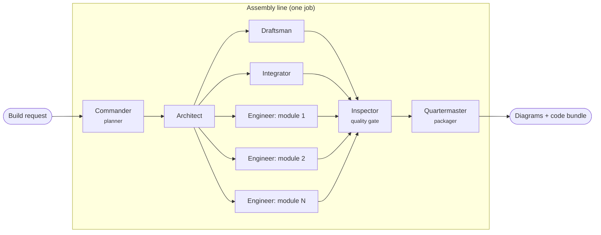

# Vectron architecture

Vectron is a software factory: a request ("build me a recon drone") goes in, and
a crew of agents produces engineering diagrams and a modular, tested codebase.
This document explains how the pieces fit and where to extend them.

## The big idea: the spec is the single source of truth

```
Blueprint (YAML)  --options-->  SystemSpec  --renderers-->  diagrams, code, ICD, docs
                                    ^
                         LLM agents propose *patches* here, never raw artifacts
```

Every artifact is rendered deterministically from one validated `SystemSpec`
(`backend/src/vectron/domain/spec.py`): subsystems, modules, typed messages,
topics, state machines, sequences and physical parameters. Consequences:

- **Diagrams and code cannot drift.** The flight-mode state diagram and the
  generated state-machine table come from the same list of transitions; the
  airframe drawing and the motor mixer share `domain/airframe.py`.
- **LLM output is contained.** Models only ever produce structured patches to the
  spec (validated by Pydantic) or module source that must pass static vetting.
  They never write diagrams, wiring or build files.
- **Builds are reproducible.** The same spec renders byte-identical files, and
  every bundle ships `vectron.spec.json` plus a manifest of SHA-256 hashes.

## Agent orchestration



The orchestrator (`orchestration/orchestrator.py`) runs a **dynamic task graph**.
A job starts with a single Commander task. When an agent finishes, it may return
new `TaskSpec`s: that is how agents employ agents. The Architect, for example,
reads the spec and spawns one Engineer per module plus the Draftsman,
Integrator, Inspector and Quartermaster. Rules:

- A spawned task depends on its parent plus any explicit `depends_on`.
- Ready tasks run concurrently up to `VECTRON_MAX_CONCURRENCY` (default 4), which
  keeps LLM rate limits in check when many Engineers are active.
- A failed task skips its dependents, and the job fails with that agent's error.
  Independent branches still finish, so partial output stays inspectable.
- Every state change is an event in an append-only log (`JobEvent`). The UI
  streams it over Server-Sent Events and can resume from any sequence number.

| Agent | Role key | Does | LLM use (when enabled) |
|---|---|---|---|
| Commander | `planner` | Picks a blueprint and options from the request | Classifies free-text briefs (falls back to keyword matching) |
| Architect | `architect` | Instantiates the spec and dispatches the crew | Proposes a validated spec patch for the brief (config, new modules/messages/topics) |
| Draftsman | `draftsman` | Renders Mermaid diagrams and the SVG airframe drawing | None, by design |
| Integrator | `integrator` | Core runtime (bus, module base, messages), wiring, sim feed, ICD | None, by design |
| Engineer | `engineer` | One module plus tests: parts library, else LLM, else stub | Implements stub modules; output is vetted |
| Inspector | `inspector` | Static quality gate: syntax, coverage, isolation, interfaces, design rules | None |
| Quartermaster | `packager` | README, manifest, zip bundle | None |

Agents are stateless classes (`orchestration/agent.py`) that receive a
`RunContext` (`orchestration/context.py`) exposing the job, its blackboard
(selected blueprint, spec), the workspace, the LLM provider and helpers to save
artifacts and log.

## Where module code comes from

1. **Parts library** (`codegen/python/parts.py` + `templates/parts/`): reviewed
   implementations of common behaviours (NMEA parsing, complementary filter, PID,
   multirotor mixing, waypoint sequencing, geofencing, mode supervision, LiPo
   state of charge, CRC telemetry framing, gimbal geo-pointing), each with
   behavioural tests. Parts bind to topics by message type, so any blueprint can
   reuse them.
2. **LLM fabrication** (Anthropic provider only): for modules with no part, the
   Engineer sends the stub, the message definitions and the core API to Claude
   and asks for an implementation plus tests. `agents/vetting.py` rejects code
   that imports anything outside a stdlib allowlist and `..core`, uses
   `eval`/`open`/`getattr`-style escapes, or changes the module's interface.
   **Generated code is never executed by the factory.**
3. **Stubs**: the interface scaffold (typed handlers, config dataclass, TODO in
   `tick`) with contract tests, so the project is green from the first build.

Each module's provenance (`part:<id>`, `llm:<model>`, `stub`) is recorded in the
job, the README and the manifest.

## Generated project anatomy

```
recon-drone/
├── README.md, ICD.md, DIAGRAMS.md, INSPECTION.md
├── vectron.spec.json          # the spec everything was rendered from
├── vectron.manifest.json      # provenance + SHA-256 of every file
├── diagrams/                  # *.mmd sources + airframe-top.svg
├── pyproject.toml             # pytest + ruff config, no runtime dependencies
├── src/recon_drone/
│   ├── core/                  # bus, module base, messages, topics, geo helpers
│   ├── <subsystem>/<module>.py
│   ├── app.py                 # the only file that knows every module
│   └── sim.py                 # sample inputs for the smoke simulation
└── tests/                     # one file per module + an integration test
```

Modules never import each other; they exchange frozen dataclass messages over
`MessageBus`, and the `Module` base class enforces the declared topics and
message types at runtime. That is what makes the per-module download work: a
module plus `core/` is a complete, testable unit.

## LLM integration

`llm/base.py` defines one method, `generate_json(system, prompt, schema)`. The
Anthropic provider (`llm/anthropic_provider.py`) uses the Messages API with
structured outputs (`output_config.format` = JSON schema), `effort` control,
streaming, and server-side refusal fallbacks (`fallbacks: "default"`) on models
that support them. Every agent treats `LLMError` as "use the deterministic path",
so a build never fails because a model call did.

Default model: `claude-opus-5` (`VECTRON_MODEL`), effort `medium`
(`VECTRON_EFFORT`). Token usage per job is recorded and shown in the UI.

## Extending Vectron

- **New system type:** add a YAML file to `backend/src/vectron/blueprints/data/`
  (or a directory on `VECTRON_BLUEPRINT_DIRS`). Options write into the spec at
  dotted paths via `applies_to`. `vectron blueprints` validates and lists it.
- **New part:** add a `Part(...)` entry in `codegen/python/parts.py` and two
  templates, `templates/parts/<id>.py.j2` and `<id>_test.py.j2` (extend
  `module/base.py.j2`). Reference it from a blueprint module with `part: <id>`.
- **New agent:** subclass `Agent`, register it in `agents/__init__.py`, and have
  an existing agent spawn it with a `TaskSpec`.
- **New code target (C++, Rust):** implement the `PythonTarget` surface
  (`scaffold`, `render_module`, `module_files`, `readme`) for the new language;
  the spec's type vocabulary (`domain/values.py`) is already language-neutral.
- **New diagram:** add a renderer in `diagrams/` and register it in
  `diagrams/__init__.py`.

## Known limits of the skeleton

- Finished jobs are saved to `<data dir>/jobs/<id>/job.json` and reloaded at startup;
  a job that is running when the server stops is lost.
- Python is the only code target, and generated tests are not run server-side.
- No authentication or multi-tenancy.
